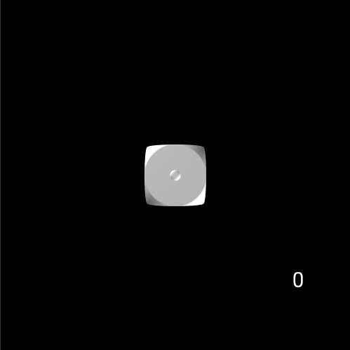

# Dice Roller
Diceroller is a simple p5.js sketch that rolls a 3d die and keeps track of the rolled value

## To install
1. npm install
2. npm start

You should now have a running dice roller sketch on a local webpack dev server: http://localhost:8080
## To use
1. Click anywhere in the sketch to roll. The dice will slow down and 'snap' to a face, and the fallow should appear in the lower right corner.
2. With the sketch 'in focus' hit the space bar, this should pause the roll

That's it!
